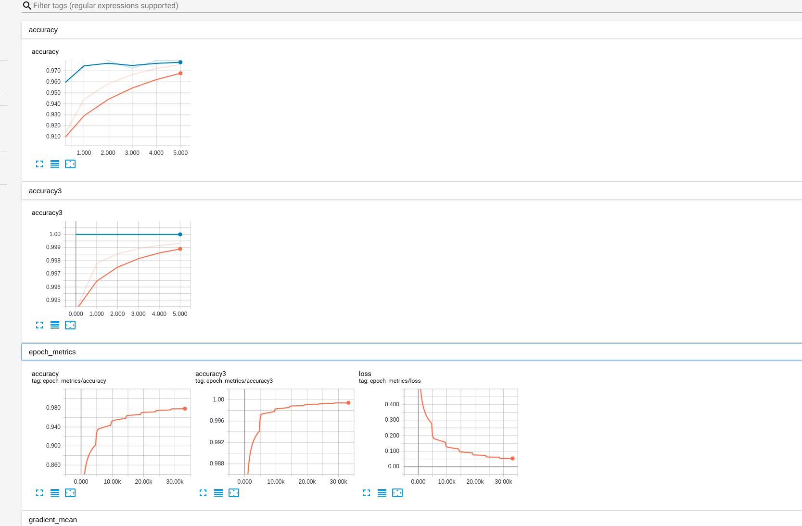
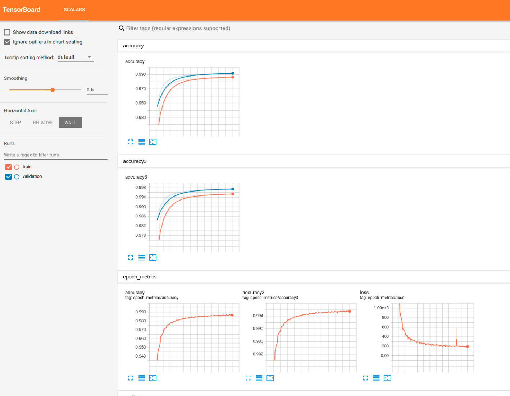
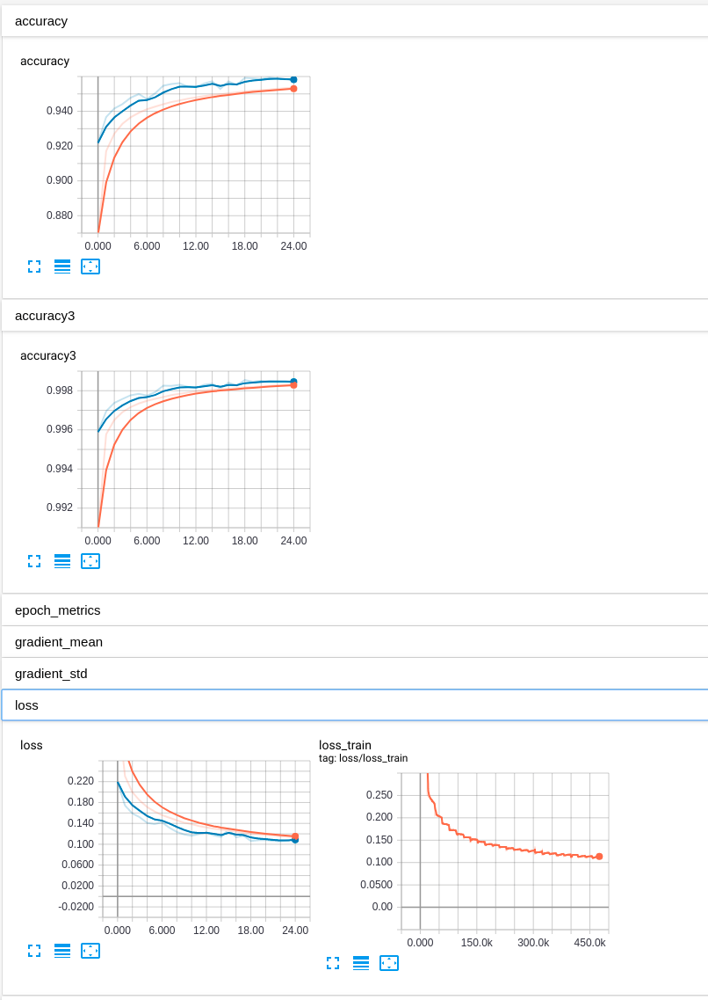

# Chinese Segmentation

This is the pytorch version for Chinese Word Segmentation based on Allennlp. I really appreciate the help form @[瑞叫兽](https://github.com/EricLingRui)

## Dependency

- allennlp
- pytorch

## Models

- BiLSTM
- BiLSTM + CRF
- Transformer

## Results

### BiLSTM

### BiLSTM + CRF

### Transfomer

## Reference

- [Neural Architectures for Named Entity Recognition](http://www.aclweb.org/anthology/N16-1030)
- [attention is all your need](https://arxiv.org/abs/1706.03762)
- [NLP-tools](https://github.com/EricLingRui/NLP-tools)
- [Allennlp](https://allennlp.org/)